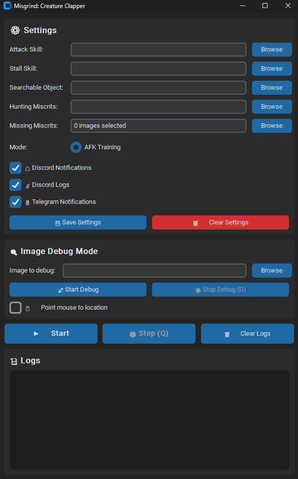

# Misgrind: Creature Clapper Version 1

> **Game Automation Assistant for Miscrits**  
> Automate battles, training, and hunting miscrits with precision image detection and customizable settings.

---

## ✨ Features
- **Auto Battle** – Engage in battles automatically with attack & stall skill logic.  
- **Auto Training** – Train your creatures while away, with looped actions.  
- **Hunting Miscrits** – Detects using an exact image of the target creature and sends a notification when found.  
- **Missing Miscrits** – Uses your current or expected creature image when no hunting image is provided, also sends a notification when found.  
- **Custom Image Detection** – Define your own skill icons, search objects, and targets.  
- **Notification System** – Optional Discord and Telegram updates for events and logs.  
- **Debug Mode** – Test and fine-tune image matching before deploying automation.  
- **Persistent Settings** – Save and reload your configuration for quick start.

---

## 📸 GUI Overview
- **Settings Panel** – Select skills, objects, and target images.  
- **Notification Toggles** – Enable/disable external alerts.  
- **Logs Panel** – Real-time state and action logs.  
- **Debug Tools** – Inspect and validate image matches.

---

## ⚠️ Disclaimer
This tool is for **educational and personal automation experiments** only.  
The author does not encourage violating any game's terms of service.

---
